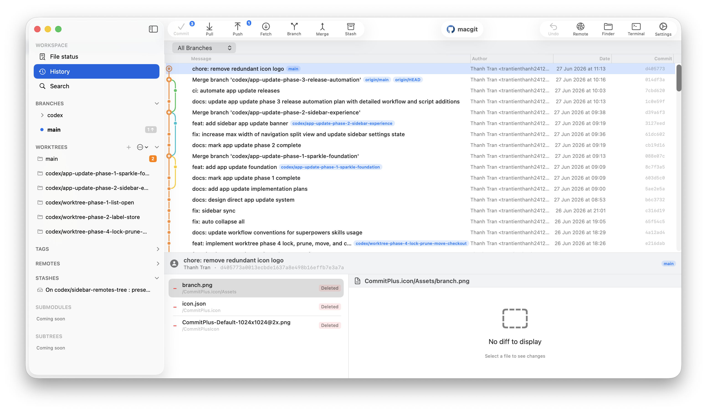

<p align="center">
  
</p>

<p align="center">
  <h1 align="center">Commit+</h1>
</p>

<p align="center">
  A fast, native Git client for macOS.<br>
  Free and open source.
</p>

<p align="center">
  <a href="https://github.com/TableProApp/TablePro/releases/latest"></a>
  <a href="https://img.shields.io/badge/macOS-26.2%2B-blue"></a>
  <a href="https://img.shields.io/badge/dependencies-0-green"></a>
  <a href="https://www.gnu.org/licenses/agpl-3.0"></a>
</p>

---

<p align="center">
  <picture>
    <source media="(prefers-color-scheme: dark)" srcset=".github/assets/Screenshot.png">
    <source media="(prefers-color-scheme: light)" srcset=".github/assets/Screenshot.png">
    
  </picture>
</p>

Commit+ is a native macOS Git client built with Swift and SwiftUI. Zero external dependencies. Git is driven via `Process()` subprocess.

## Why Commit+

macOS Git clients today fall into three groups:

- **Command line**: Powerful but requires memorizing dozens of commands and flags.
- **Electron-based**: Source Tree, GitKraken, Fork. Cross-platform but not native—slow to start, heavy on memory, inconsistent with macOS conventions.
- **Proprietary**: Tower. Polished and native, but paid and closed source.

Commit+ is the missing fourth: native, lightweight, and open source.

## Features

### Drag & Drop

Complex Git actions become effortless with drag and drop:

- **Reorder / Squash Commits**: Drag commits in the history view to reorder, squash, or fixup (interactive rebase)
- **Cherry-Pick / Revert**: Drag commits between branches to cherry-pick; hold ⌥ to revert
- **Merge / Rebase Branches**: Drag a branch onto HEAD to merge; hold ⌥ to rebase instead
- **Push / Pull Branches**: Drag branches to the remote section to publish or pull
- **Stage / Stash Files**: Drag files between working copy, staged, and stash views
- **Apply Stashes**: Drag a stash or individual file back to the working copy to apply

### Undo Any Action

Tower-style undo/redo for stage/unstage, commits, stashes, branch operations, discards, and remote actions. Press `Cmd+Z` to undo, `Cmd+Shift+Z` to redo.

### Full Git Management

Commit, Pull, Push, Fetch, Branch, Merge, Rebase, Stash, Cherry-pick, Revert, Reset — all with keyboard shortcuts.

### Built-in Conflict Resolution

Visual diff viewer with inline conflict markers, stage resolution, and abort merge/rebase — resolve conflicts without leaving the app.

### Smarter Worktree Management

Create, switch, and remove git worktrees from the sidebar for isolated parallel feature work, all managed visually.

### AI Features *(coming soon)*

- **AI Commit Generation**: Auto-generate commit messages from your staged diff
- **AI Conflict Resolution**: Smart suggestions for resolving merge conflicts

### Quick Search

Spotlight-style search modal (`Cmd+Shift+F`) to instantly find commits, files, branches, and tags.

## System Requirements

- **macOS**: 26.2+
- **Xcode**: 26.2+ (to build from source)
- **Git**: Installed on the system (Homebrew or Xcode Command Line Tools)

## Build & Run

```bash
# Build
xcodebuild -project macgit.xcodeproj -scheme macgit -destination 'platform=macOS' build

# Run
open $(ls -dt ~/Library/Developer/Xcode/DerivedData/macgit-*/Build/Products/Debug/Commit+.app | head -n 1)

# Release build
xcodebuild -project macgit.xcodeproj -scheme macgit -configuration Release -destination 'platform=macOS' build
```

Or open in Xcode and press `Cmd+R`:

```bash
open macgit.xcodeproj
```

## Testing

```bash
xcodebuild -project macgit.xcodeproj -scheme macgit -destination 'platform=macOS' test
```

## Tech Stack

| Technology | Detail |
|-----------|--------|
| **Language** | Swift 5.0 |
| **UI Framework** | SwiftUI |
| **Platform** | macOS 26.2+ |
| **Concurrency** | Swift async/await, actor |
| **Git Engine** | System Git via `Process()` subprocess |
| **Dependencies** | **None** — 0 external dependencies |

## Project Structure

```
macgit/
├── App/                 # App entry point & global state
├── Views/               # SwiftUI views
├── Services/            # Git operations & business logic
├── Models/              # Data models
├── ViewModels/          # View models
└── Resources/           # Assets
```

## Keyboard Shortcuts

| Shortcut | Action |
|----------|--------|
| `Cmd+Shift+C` | Commit |
| `Cmd+Shift+P` | Pull |
| `Cmd+Option+P` | Push |
| `Cmd+Option+F` | Fetch |
| `Cmd+Shift+B` | Branch |
| `Cmd+Shift+M` | Merge |
| `Cmd+Shift+S` | Stash |
| `Cmd+Shift+F` | Search |

## License

This project is licensed under the [GNU Affero General Public License v3.0 (AGPLv3)](LICENSE).

---

*Built for the macOS developer community.*
